<h1 align="center">
    <br>
    Library Management System
    <br>
</h1>


[]()
[]()
[]()
[]()

an application using Spring Boot, and MySQL. 
* This is a Library Management System with an Admin and a Patron side for the application. 
* Admin can perform CRUD with books/Patrons. 
* Patron can borrow and return a book. 
* Admin and Patron JWT to authenticate login.
* Uses BCryptPasswordEncoder to encrypt the password stored in the database.
* Redirects to forbidden page if a role doesn't have access to the url.
<br>

# APIs
## Authenticate
* singUp.
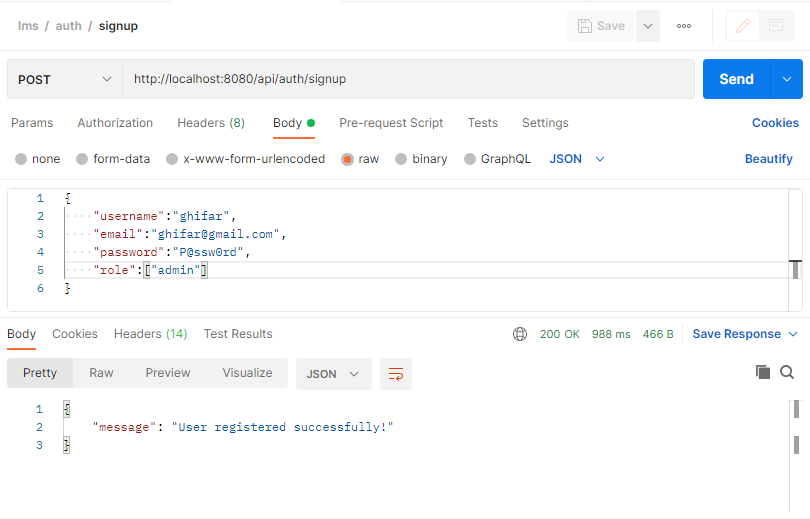
<br>

* singIn.
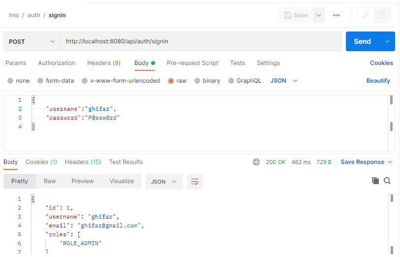
<br>

* singOut.

<br>

## Book
### All books present
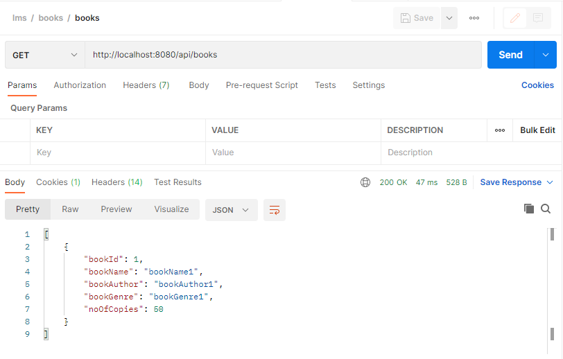

### Book By id 


### Adding a book
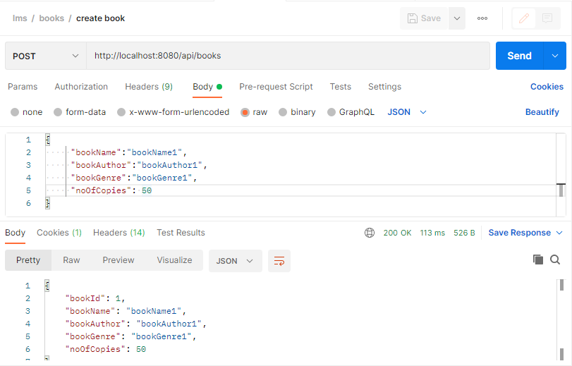

### Updating book details
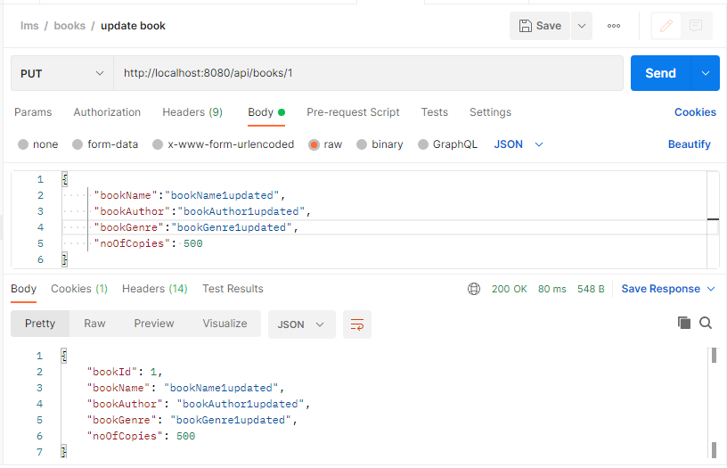

### Deleteing book 
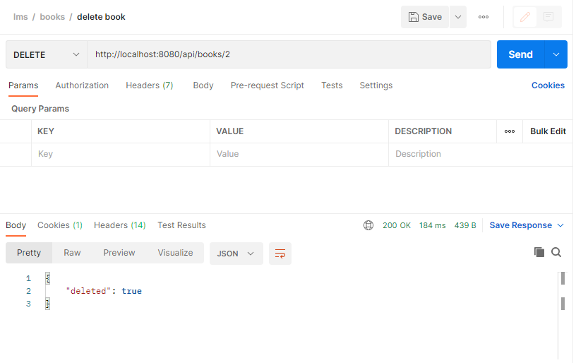

## Patrons

### All Patrons 
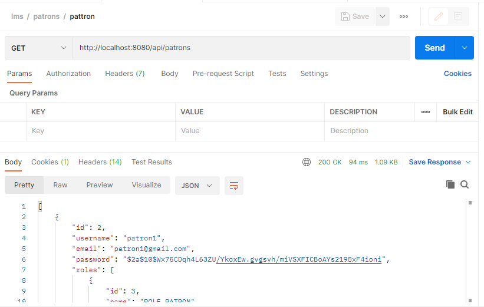

### Patron By id 


### Adding a Patron By Admin
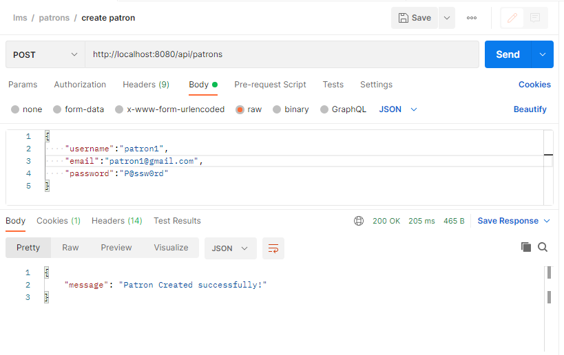

### Updating patron details
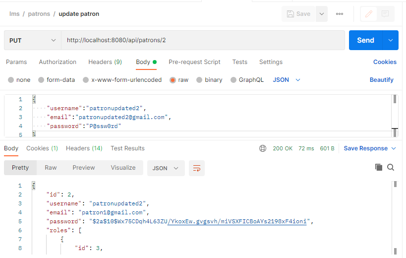

### Deleteing Patron 
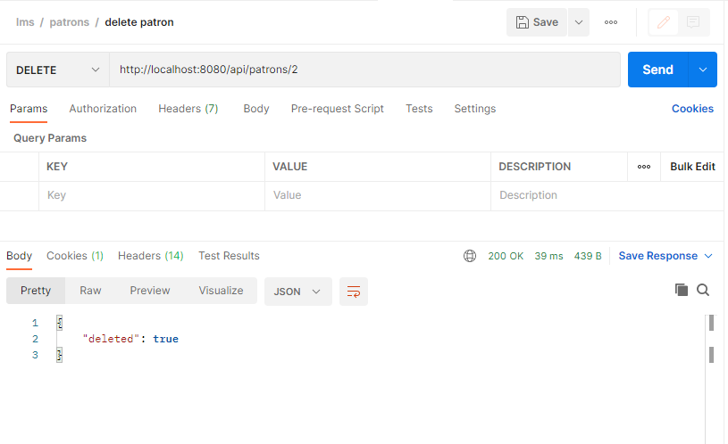

## Borrow
### Borrow book
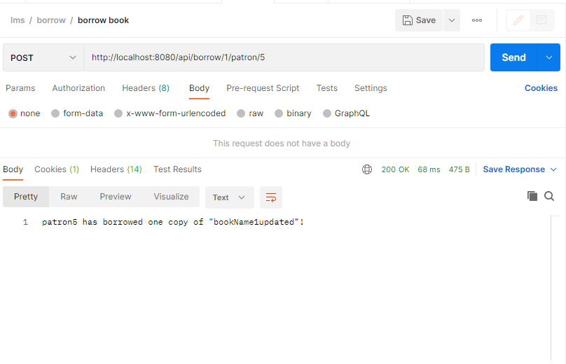

### Borrow history of a book
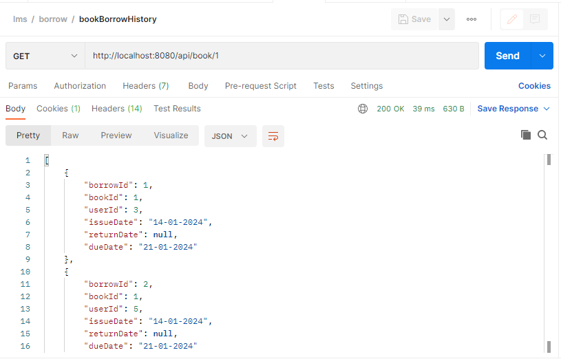

### Book Borrow By User
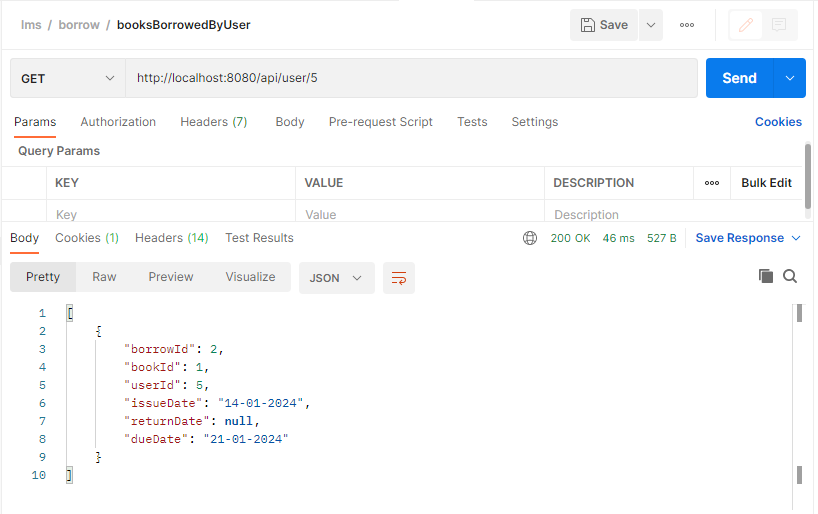

### Return book
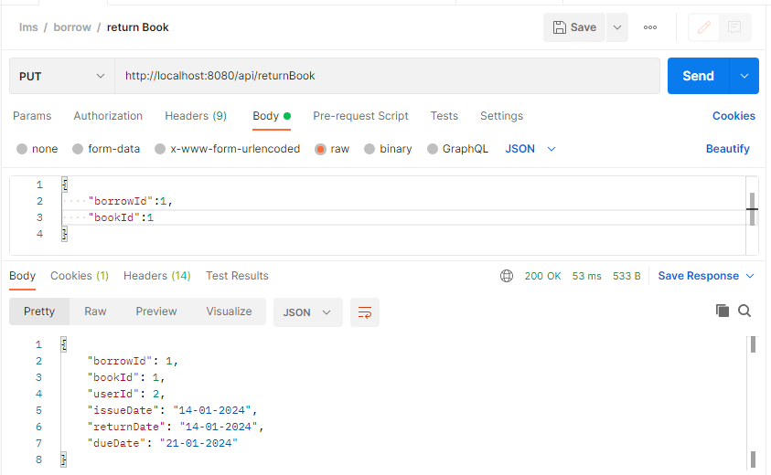

### Unauthorized
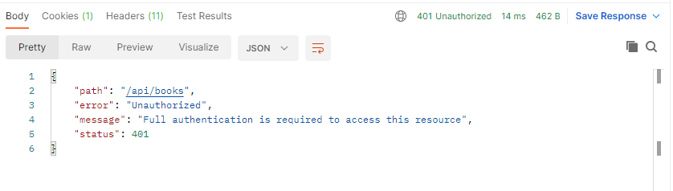


# Application Properties
```
spring.datasource.url = jdbc:mysql://localhost:3306/yourSchemaName
spring.datasource.username = yourUsername
spring.datasource.password = yourPassword
```
## Using Library Management System
Intellij/Eclipse-->
1. you must create your database first and add database configurations to Application Properties file
2. Let maven resolve dependencies 
3. import lms.postman_collection.json file into postman to communicate with APIs
4. run SpringBootApplication

Prepared By :E.Ghifar Mhd
